# QRIS end-to-end test report

**Date:** 21 August 2026
**Environment:** sandbox (`MAYAR_ENV: "sandbox"`, host `https://api.mayar.io`)
**Merchant:** `faizintifada.myr.lat` — sandbox account `ad732280-0509-45f3-932f-92a50c381052`
**Dev server:** `bun dev` on port 3000
**Driver:** `agent-browser` 0.33.1, Chrome, one session (`mayar-qris`)
**Payment channel:** QRIS only, on every model that reached a payment page

**Verdict: all six models that can reach a payment now complete a QRIS payment
end to end.** One model is blocked by a Mayar outage already documented, and one
cannot be simulated at all because the sandbox provides no way to pay a
standalone QRIS code.

The first pass of this run found four defects. All four are fixed and
re-verified; the sections below record what was found, and
[Fixes applied](#fixes-applied) records what changed. The most serious was not
in our code:

- **`GET /hl/v2/transactions` returns a stale page at `limit=50`** — the exact
  value the documentation invites you to use. It made the reconciler blind to
  every payment it was waiting for, without an error anywhere. This is Mayar's
  bug and it is now finding 28 in `api-findings.md`.
- **Membership crashed with an HTTP 500** on every checkout, and its bill
  carried no transaction id to match on. Two wrong response types. Ours.
- **Instalment orders could never be marked paid** — written with no matching
  key of any kind. Ours.
- **`nativeButton`** — six controls silently lost button semantics. Ours.

One documented finding also changed shape: the two sandbox hosts are **not**
interchangeable, corrected as finding 23 and added as finding 27.

---

## Results

| # | Model | Route | QRIS offered | Coupon | Order | Charged | Final status | Fulfillment | Verdict |
|---|---|---|---|---|---|---|---|---|---|
| 1 | `sekali-bayar` | `/billing/sekali-bayar` | yes | `SEKALI50` | `ord_a7db4ebb` | Rp1.000 | **Lunas** | `receipt` | **Pass** |
| 2 | `fulfillment` | `/billing/sekali-bayar-fulfillment` | yes | `FULFILL50` | `ord_5bfe7447` | Rp1.000 | **Lunas** | `r2_grant`, `receipt` | **Pass** |
| 3 | `invoice` | `/billing/invoice-berbutir` | yes | `INVOICE50` | `ord_164570b3` | Rp1.000 | **Lunas** | `receipt` | **Pass** |
| 4 | `membership` | `/billing/membership` | yes, chosen by hand | n/a (tier-priced) | `ord_c1379bb2` | Rp2.000 | **Lunas** | `membership_register`, `receipt` | **Pass after fix** |
| 5 | `kredit` | `/billing/dompet-kredit` | never reached | n/a (tier-priced) | none | — | HTTP 503 before any call | none | **Expected failure** |
| 6 | `saas` — checkout | `/billing/lisensi-saas` | yes | n/a (tier-priced) | `ord_148caef1` | Rp2.000 | **Lunas** | `license_issue`, `receipt` | **Pass** |
| 6b | `saas` — licence panel | `/billing/lisensi-saas` | n/a | n/a | n/a | — | HTTP 502 | none | **Expected failure, new shape** |
| 7 | `qris` | `/billing/qris-dinamis` | drawn in-app | `QRIS50` | `ord_ebbd7de4` | Rp1.469 | `pending` | none | **Blocked — sandbox cannot pay this** |
| 8 | `cicilan` | `/billing/cicilan` | yes, though the server does not force it | `CICILAN50` | `ord_2e5c5b15` | Rp3.000, term 1 Rp1.000 | **Lunas** | `schedule`, `receipt` | **Pass after fix** |

Rows 1, 2, 3, 6 and 8 were re-run end to end after the fixes and settled again;
row 4 passes only after them. Screenshots for every row are in
[`test-evidence/`](test-evidence/) and linked from the sections below.

---

## The sandbox simulator

The Mayar sandbox hosted payment page carries a **Simulate Payment** button on
the QRIS screen. Every payment in this report was made with it. No real money
moved.

The flow on every hosted page is the same three steps:

1. **Pay** on the invoice page.
2. **QRIS** from the channel list.
3. **Simulate Payment** under the QR image, which answers
   `Payment simulation successful! Please wait while we process the callback.`
   and then `Transaction Success`.

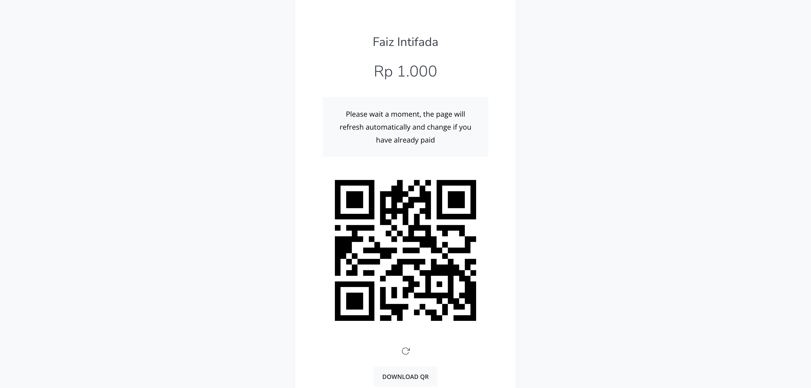

This resolves the one assumption the test plan could not verify in advance. It
also means the QRIS path is genuinely testable without spending money —
provided the model produces a hosted page at all. Model 7 does not, which is
the whole of its problem.

---

## Successes

### Reconciler latency

Before the fixes, settled orders reached `Lunas` roughly **8 to 15 seconds**
after the simulate click — consistent with `DIRECT_CHECK_AFTER_MS` (15 s) doing
the work, because the balance-history poll was returning a stale page and
contributing nothing.

After the fixes the same models settle **within 5 seconds**, on the first poll
that sees the payment. The direct check is now the fallback it was meant to be
rather than the only thing working. That speed-up is the visible half of
defect D below.

### 1. `sekali-bayar` — pass

Coupon `SEKALI50` took Rp2.000 to Rp1.000, and the discounted amount is what
reached Mayar — the hosted invoice page showed **Rp 1.000**, not the list price.
Transaction `6f756025-d04b-452a-abef-badbc51e3340`. Fulfillment: `receipt`.

The negative coupon path was also checked here: `SALAHKODE` was rejected with
`Kode diskon tidak berlaku untuk produk ini.` and the total stayed at Rp2.000.

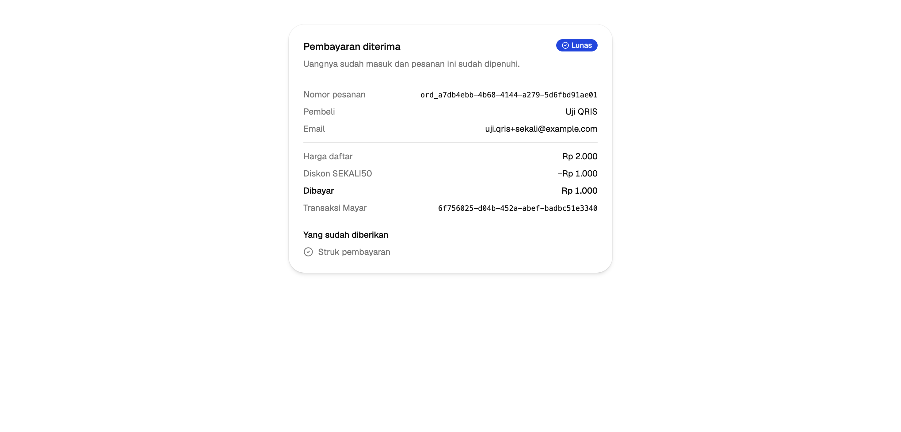

### 2. `fulfillment` — pass, including the download

Same billing path, plus the R2 grant. Both fulfillment kinds were recorded
(`r2_grant`, `receipt`) and the **Unduh berkas** button appeared.

`GET /api/fulfill/ord_5bfe7447-…` returned **HTTP 200, `application/zip`, 276
bytes**, a valid archive containing `README.txt`. The error paths behave as
written:

| Request | Result |
|---|---|
| Valid grant | `200 application/zip` |
| Same grant, second request | `200 application/zip` |
| Unknown order | `404` |
| Paid order with no grant (`ord_a7db4ebb`) | `403 "Pesanan ini tidak memberi hak unduh."` |

The second download also succeeding is **correct, not a defect**. The
`fulfillments_once (order_id, kind)` index makes *claiming* the grant
at-most-once; the grant itself stays usable for its 15-minute TTL, and a buyer
whose download drops halfway needs exactly that.

Minor note: the delivered archive is a 276-byte placeholder holding one
`README.txt`, not the "240 ikon SVG" the page advertises. Fine for a demo, but
the copy and the payload disagree.

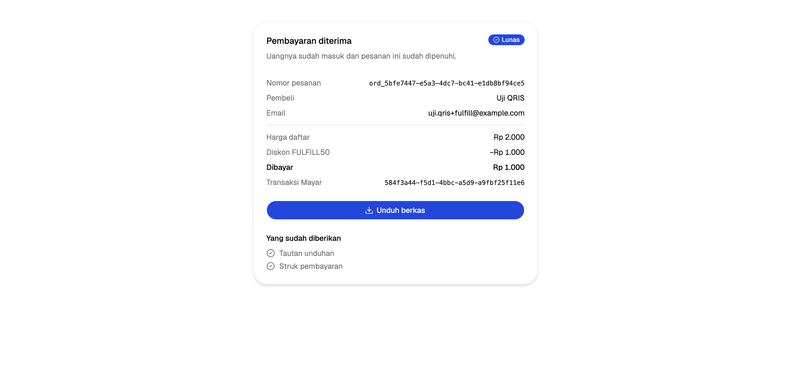

### 3. `invoice` — pass, discount spread correctly

The three line items (1000 / 700 / 300) totalled Rp2.000 and the hosted invoice
showed **Rp 1.000** after `INVOICE50`. The discount was spread across the rates
rather than added as its own line, exactly as
[`spreadDiscountAcrossItems`](../src/lib/money.ts) intends and as finding 6 in
`laporan-mayar.md` requires. Transaction `7bf2a69b-1af1-47c9-a4e2-0183060808b5`.

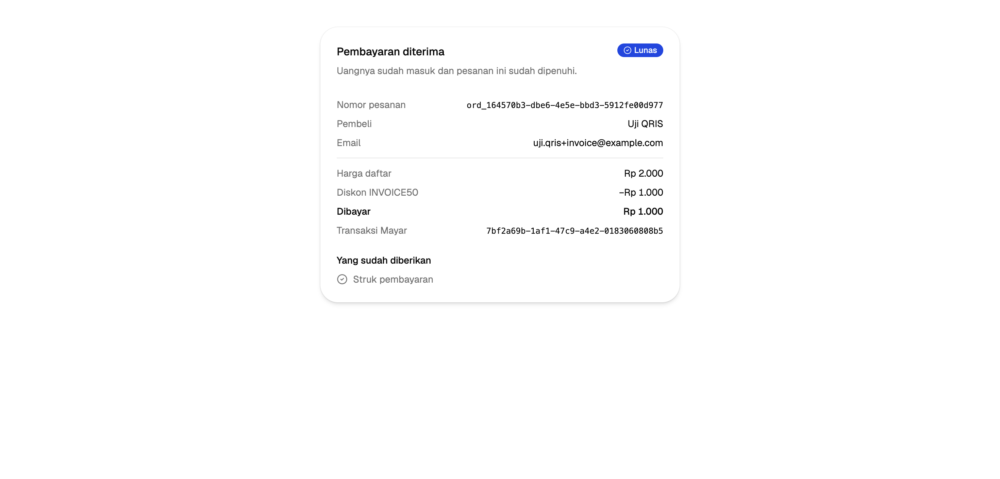

### 6. `saas` checkout — pass

The licence *panel* fails (see below), but the licence *product's checkout*
works. It falls through to the `default` branch of `createCheckout`, so it
bills like `sekali-bayar`. Paid Rp2.000, transaction
`fd3feb9c-7883-4a39-9041-1fe99294f8cd`, fulfillments `license_issue` and
`receipt`.

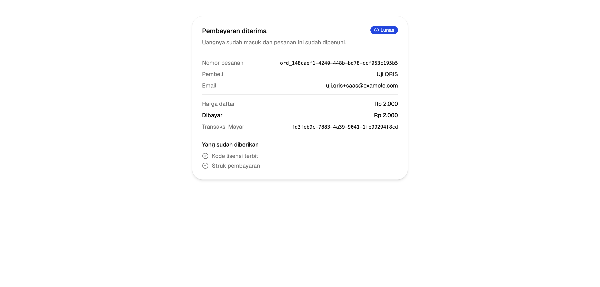

### Cross-cutting checks

| Check | Result |
|---|---|
| All eight models reachable from `/` | **Pass** — index grid, header dropdown, and both footer columns all list eight |
| Coupon field disabled on tier-priced models | **Pass** — `membership`, `kredit`, `saas` show `Tidak tersedia` with the `TIER_PRICED` reason |
| Unknown order id | **Pass** — `Pesanan tidak ditemukan` |
| Resume-order banner | **Pass** — `Ada pesanan yang belum selesai` for a pending order, and the key is cleared once the order settles |
| Coupon redeemed only after payment | **Pass** — `SEKALI50`, `FULFILL50`, `INVOICE50` redeemed; `QRIS50` and `CICILAN50` still unredeemed because those orders never settled |
| Popup handling | **Pass** — `window.open` was not blocked; the watching tab advanced to the receipt on its own |
| `bun run test` | **Pass** — 30 tests, 2 files |

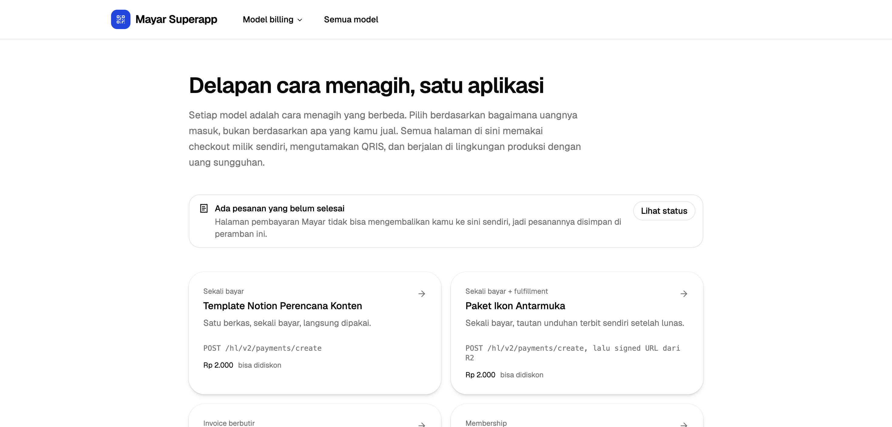

---

## Errors — our defects

### A. `membership` checkout returned HTTP 500 on every attempt

**Severity: blocking. Fixed — see [Fixes applied](#fixes-applied).** The model
could not be sold at all.

Requested:

```
POST /api/checkout
{"model":"membership","name":"Uji QRIS","email":"…","mobile":"081234567890"}
```

Returned:

```json
{"status":500,"unhandled":true,"message":"HTTPError"}
```

Server log:

```
TypeError: Cannot read properties of undefined (reading 'memberId')
    at createCheckout (src/server/checkout.ts:166:46)
    at POST (src/routes/api/checkout.ts:151:27)
```

**Root cause.** [`src/lib/mayar/types.ts:247`](../src/lib/mayar/types.ts) declares
`RegisterMemberResponse` as `{ membershipCustomer: { id, memberId, … } }`.
Mayar sends no such wrapper. A direct probe of the endpoint returns the member
object at the top level of `data`:

```json
{"statusCode":200,"message":"success","data":{
  "id":"188410c1-c40d-4ff6-859a-0ec3db835055",
  "memberId":"V67Q2PE2",
  "customerId":"0cad2f34-…","membershipTierId":"fbc0f7a8-…",
  "status":"active","customer":{…},"membershipTier":{…}}}
```

`mayarFetch` unwraps the envelope to `data`, so `member.membershipCustomer` is
`undefined` and reading `.memberId` throws. The type is wrong, so TypeScript
never caught it.

**Why the fallback does not save it.** The `catch` at
[`checkout.ts:167`](../src/server/checkout.ts) only handles `MayarApiError`. A
`TypeError` is rethrown, reaches the route's own `catch` — which also only
handles `MayarApiError` — and escapes as an unhandled 500. The returning-buyer
path via `listMembers` is therefore dead code that has never run.

**Fix.** Drop the wrapper from the type and read the fields directly:

```ts
memberId = member.memberId
memberRecordId = member.id
```

**A second fault hid behind the first.** Once checkout stopped throwing, the
order still never settled, because `CreateMembershipInvoiceResponse` also
declared a `transactionId` that Mayar does not send. The bill's real shape is
`{id, name, term, membershipTierId, amount, status, createdAt,
membershipBillUrl}`. The field being *absent* rather than *wrong* meant the
order was written with an empty transaction id and silently fell out of the
certain-match path with no fallback key. Membership is now matched on the
buyer's email plus the tier's own amount, like the other identifier-less
models.

**Side effect.** Two orders are stranded at `created` with no Mayar record
(`ord_299d5c75`, `ord_a57cc9fe`) because `createOrder` runs before the crash.
`expireStale` will retire them after 30 minutes.

**Reproduce:** open `/billing/membership`, fill the form, submit. The form shows
the generic `Checkout gagal. Coba lagi.` because the 500 body carries no
`error` field for the client to display.

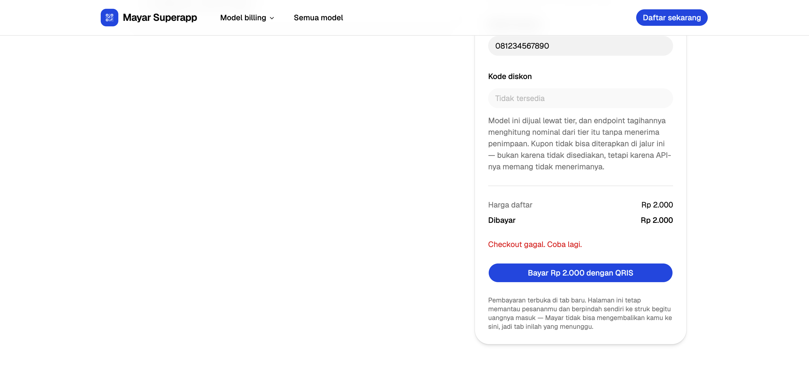

### B. `cicilan` orders could never be marked paid

**Severity: blocking. Fixed — see [Fixes applied](#fixes-applied).** The buyer
paid and the app never noticed.

Term 1 (Rp1.000, due 10 Sep 2026) was paid through the QRIS simulator and
answered `Transaction Success`. The status page then sat at
`Menunggu pembayaran` for the full 90-second wait and never advanced.

**Root cause.** The instalment branch of `createCheckout` stores only the plan
id:

```ts
await attachMayarIds(db, orderId, { mayarId: plan.id, payUrl: first })
```

No `transactionId` is stored, and `createOrder` sets `match_amount` only for
`qris` and `match_email` only for `kredit`. The row confirms it:

| id | model | status | amount_net | transaction_id | match_amount | match_email |
|---|---|---|---|---|---|---|
| `ord_bc5adaea` | cicilan | pending | 3000 | *(null)* | *(null)* | *(null)* |

[`matchPayments`](../src/server/matching.ts) skips the certain-match loop when
`transaction_id` is null, then falls into the heuristic loop where the final
`return false` at [line 86](../src/server/matching.ts:86) rejects any order with
neither `match_amount` nor `match_email`. **A cicilan order is unmatchable by
construction** — no amount of waiting or retrying will settle it.

A second mismatch sat underneath: the order's `amount_net` is Rp3.000, the whole
plan, while term 1 pays Rp1.000. Even with a matching key, an amount-based match
would have compared the wrong numbers.

**Could the term's own id have been used instead?** No, and this was worth
testing rather than assuming. `installments/create` does return an `id` per
term, but a paid term reports a *different* id in balance history. Measured
directly: term id `cb62e7a7-4891-4df3-a740-3aec057da057`, balance-history
`paymentLinkTransactionId` `9295deca-62ba-4767-b686-04dde3907193`. So a certain
match is impossible here and a heuristic is the only option.

**What "paid" now means for a plan: the first term.** It cannot reasonably mean
all three. An order expires after `ORDER_TTL_MS` — thirty minutes — while terms
two and three fall due in the following months, so waiting for the whole plan
would guarantee every instalment order expired unpaid. The `schedule`
fulfillment already delivers the payment plan itself, which is exactly what
exists once the first term clears.

**Reproduce:** open `/billing/cicilan`, apply `CICILAN50`, submit, pay term 1
with the simulator, and watch the status page stay at `Menunggu`.

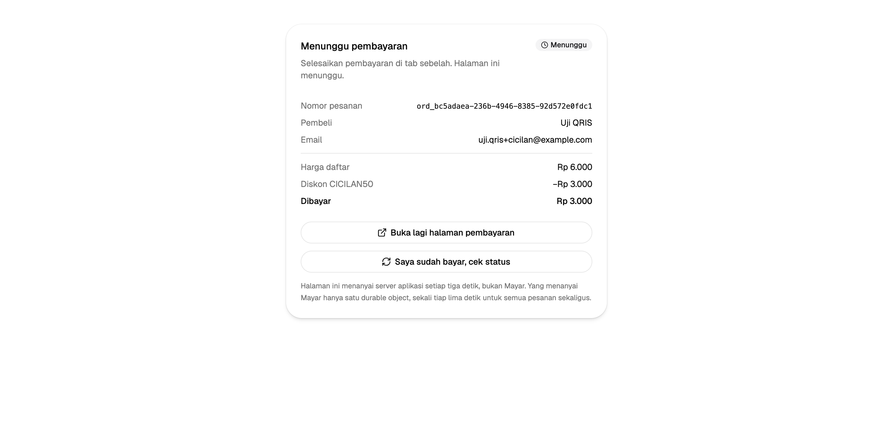

### C. Base UI `nativeButton` accessibility error, thrown repeatedly

**Severity: low, but a real accessibility loss. Fixed — see
[Fixes applied](#fixes-applied).**

```
Base UI: A component that acts as a button expected a native <button> because
the `nativeButton` prop is true. Rendering a non-<button> removes native button
semantics, which can impact forms and accessibility.
```

Thrown by [`src/components/ui/button.tsx:33`](../src/components/ui/button.tsx)
wherever `Button` receives a `render` prop that is an anchor or a `Link`.
Observed call sites:

- `src/routes/checkout.$orderId.tsx` (the pay-again and download buttons)
- `src/components/checkout/resume-order.tsx:65`
- `src/components/billing/checkout-section.tsx:66`
- `src/components/marketing/pages/saas-page.tsx:177`
- `src/components/marketing/pages/cicilan-page.tsx:150`
- `src/components/marketing/pages/kredit-page.tsx:180`

Twenty-odd other call sites already passed `nativeButton={false}` by hand, so
the intent was established — it was just applied inconsistently, and a prop you
must remember at every call site is one you will eventually forget. The default
is now answered once inside `Button`.

---

## Errors — Mayar's, and expected

### D. `kredit` — `/hl/v2/credit/*` still answers 404

**Confirmed unchanged.** Finding 2 in
[`laporan-mayar.md`](laporan-mayar.md) still stands.

The app fails closed and correctly, before spending anything:

- The card on `/` carries the **Terhalang** badge.
- The submit button reads `Belum bisa dibayar` and is `disabled`.
- A direct POST returns **HTTP 503** with the blocked reason from the catalog.

Re-probed live, on both sandbox hosts, with the same key that works elsewhere:

| Request | `api.mayar.io` | `api.mayar.club` |
|---|---|---|
| `GET /hl/v2/payment-channels` | 200 | 200 |
| `POST /hl/v2/credit/generate/immutable/checkout` | 404 | 404 |
| `POST /hl/v2/credit/balance` | 404 | 404 |

The host is not the explanation here. The credit group is absent from both.

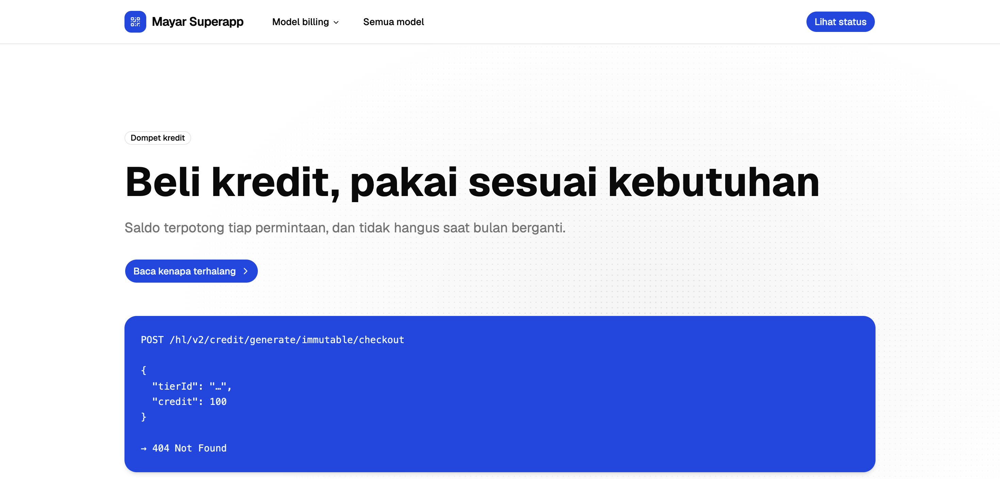

### E. `saas` licence panel — same failure, different shape

**The failure is expected. Its shape is not, and `api-findings.md` needs
updating.**

The panel now reports:

```
Mayar returned a non-JSON response (HTTP 502)
```

Not the documented `401 Failed authentication!`. Probing the endpoint directly
explains why — **the two sandbox hosts are not interchangeable**:

| Host | `POST /saas/v2/license/verify` |
|---|---|
| `api.mayar.io` | **HTTP 502**, `content-type: text/plain`, body `Bad Gateway` |
| `api.mayar.club` | **HTTP 200**, JSON `{"statusCode":401,"messages":"Failed authentication! Please check your token authorization."}` |

So `/saas/v2` is not routed on `api.mayar.io` at all, while `/hl/v2` answers
200 on both. This **contradicts finding 23** in
[`api-findings.md`](api-findings.md), which records the two hosts as "real and
interchangeable". They are interchangeable for `/hl/v2` and not for `/saas/v2`.
This is exactly the question `MAYAR_API_URL` was added to settle, and it now
has an answer.

Two consequences:

1. Finding 23 should be narrowed to `/hl/v2`.
2. Finding 1 — `/saas/v2` rejecting a key that `/hl/v2` accepts — is still
   reproducible, but only against `api.mayar.club`. Reported against
   `api.mayar.io` it now looks like a gateway outage instead of an auth bug,
   which weakens the report to Mayar.

The route's own validation is sound: empty code → `400 Kode lisensi wajib diisi.`,
unknown action → `400 Aksi tidak dikenal.`

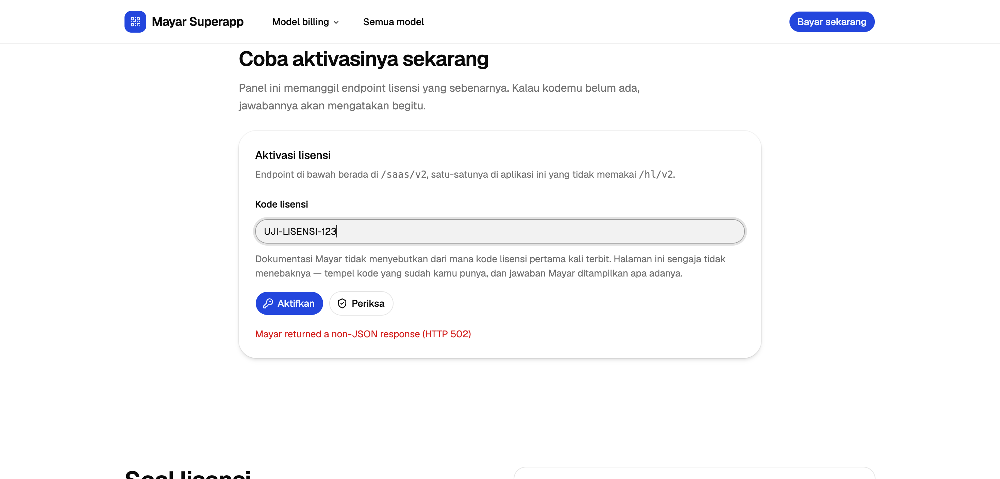

---

## Blocked — the sandbox cannot do this

### F. `qris` cannot be paid or simulated

**Not a defect. A genuine gap in what the sandbox exposes.**

The model itself works up to the point of payment. Order `ord_ebbd7de4` was
created, `QRIS50` applied, and the unique code was added correctly:
**Rp2.000 → Rp1.000 → Rp1.469**, with `match_amount = 1469` stored for the
reconciler. The QR rendered inline at 480×480 and the page told the buyer to
pay `Rp 1.469` exactly.

The problem is that there is nothing to click. Unlike every other model, this
one produces no hosted Mayar page, so there is no **Simulate Payment** button.
A direct probe shows the endpoint returns nothing that could stand in for one:

```
POST /hl/v2/qr-codes/create  {"amount":1234}
→ {"statusCode":200,"messages":"success",
   "data":{"url":"https://media.mayar.club/images/resized/480/…png","amount":1234}}
```

Only `url` and `amount`. No transaction id, no payment link, no simulation
endpoint. **The only way to settle a standalone QRIS code is to scan it with a
real QRIS app and pay real money**, which this run deliberately did not do.

The order therefore stays `pending` until `expireStale` retires it at 30
minutes. The unique-code matching path in `matchPayments` — the one heuristic
that could misfire in production — remains untested against a live payment. It
is covered by unit tests in `matching.test.ts` and by nothing else.

Incidental note: the QR image is served from `media.mayar.club` even though the
API call went to `api.mayar.io`, another sign that the two hosts are one
deployment with uneven routing rather than two mirrors.

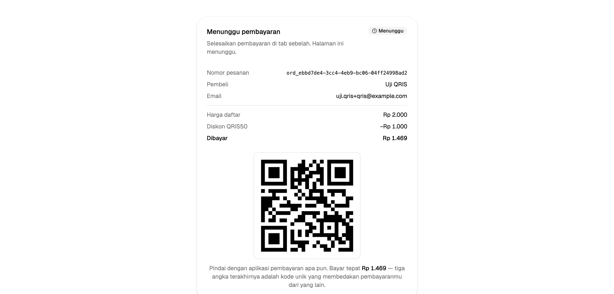

---

## Fixes applied

All four defects are fixed, and every change was verified by paying again
through the sandbox simulator rather than by reasoning about the code.

### D. The one that mattered most: `limit=50` returns a stale page

**This is Mayar's bug, not ours, and it was invisible.** Nothing errored. The
buyer saw `Transaction Success`, the reconciler ran on schedule, and the order
sat at `Menunggu`.

`GET /hl/v2/transactions` returns fewer and older rows as the limit grows:

```
?limit=10   -> 10 rows, newest payment present, hasMore true
?limit=40   -> 40 rows, newest payment present, hasMore true
?limit=50   -> 43 rows, newest two payments MISSING, hasMore false
?limit=100  -> 43 rows, the same stale page
```

The cliff sits exactly at fifty — the documented maximum, and therefore the
value `MAX_PAGE` held. `hasMore: false` on that page compounds it: the client is
told there is nothing more to fetch, so it cannot even detect the truncation.

Filtering made it worse. `?status=paid` omits rows whose own `status` field
reads `"paid"`: a `membership_payment` row sat at the top of the unfiltered page
while being absent from the filtered one for over three minutes. Diffing the two
pages by row id, that row was the only difference.

This is why four models appeared to work. They carry a transaction id, so
`GET /hl/v2/transactions/{id}` confirmed them directly after 15 seconds. Every
model matched *without* an id depended on the balance history, and the balance
history was lying.

**Fix.** [`operations.ts`](../src/lib/mayar/operations.ts) now uses a dedicated
`BALANCE_PAGE = 40` and sends no `status` filter; `matchPayments` already reads
`PAID_STATUSES` off each row, which trusts the field rather than the query. The
measurements are recorded in the constant's docblock so the next person does not
have to rediscover them, and as finding 28 in
[`api-findings.md`](api-findings.md).

**Effect.** Settlement went from 8–15 seconds via the fallback path to under 5
seconds on the first poll, and the heuristic-matched models settle at all.

### The other three

| Defect | Change |
|---|---|
| A — membership 500 | `RegisterMemberResponse` flattened to the real shape; `checkout.ts` reads `member.memberId` / `member.id`. `CreateMembershipInvoiceResponse` corrected to drop the `transactionId` that is never sent, and membership now matches on email plus tier amount. |
| B — cicilan unmatchable | The order now carries the buyer's email at creation and the first term's amount once Mayar has split the plan, via a new `matchAmount` field on `attachMayarIds`. `CheckoutOutcome.schedule` reports `term` instead of a `dueDate` that was always `undefined`. |
| C — `nativeButton` | `Button` derives the default from whether a `render` prop was given. An explicit `nativeButton` still wins. |

`matchPayments` was generalised to support this: a candidate must satisfy
**every** key an order carries, and an order carrying no key never matches. That
last clause is the one that would have caught defect B at review time, and it is
now asserted by a test named after it.

### Checks

| Check | Result |
|---|---|
| `bun run test` | **35 pass**, up from 30 — five new cases covering instalment matching, the ambiguous two-equal-terms case, and the keyless order |
| `bun run typecheck` | clean |
| `bun run lint` | clean |
| `nativeButton` errors across the six affected pages | **0**, previously one per render |
| Regression: models 1, 2, 3, 6, 8 re-paid end to end | all settle, all fulfillments correct |
| Regression: `/api/fulfill` download | `200 application/zip` |
| Regression: kredit 503, licence 502, input validation 400s | unchanged |

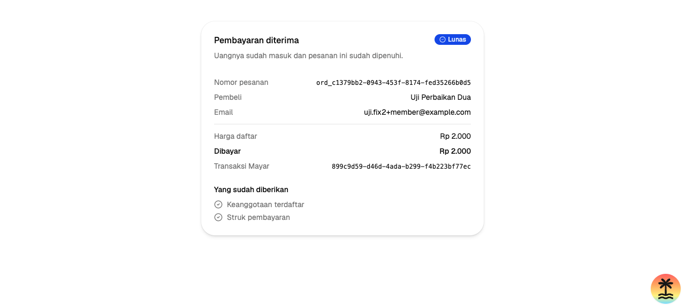
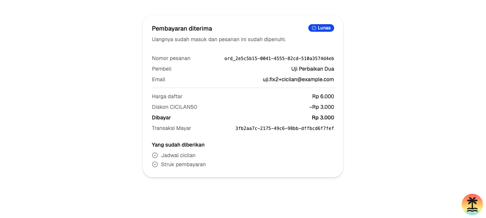

---

## What is left

Everything found in this run is fixed. What remains is either Mayar's to fix or
genuinely undecided:

1. **Report finding 28 to Mayar.** The `limit=50` staleness is the sort of bug
   that costs other integrators real money, silently — a payment taken and an
   order never fulfilled, with nothing in any log. It is worth raising ahead of
   the two findings already queued.
2. **Re-anchor finding 26 to `api.mayar.club`** before the report goes back.
   Against `api.mayar.io` the `/saas/v2` failure now presents as a 502 gateway
   error, which reads as an outage rather than the authentication bug it is, and
   is easier to dismiss.
3. **`kredit`** stays blocked until `/hl/v2/credit/*` exists. Nothing to do here.
4. **`qris`** cannot be settled in the sandbox at all. Its unique-amount match is
   covered by unit tests and by nothing else, and will stay that way until either
   a real QRIS payment is made or Mayar exposes a simulator for standalone codes.

Two smaller things noted rather than fixed, because both are content decisions
rather than defects: the `fulfillment` archive is a 276-byte placeholder that
does not match its own "240 ikon SVG" product copy, and a membership checkout
that fails after `createOrder` leaves an orphan `created` row until
`expireStale` retires it.

---

## Caveats

**Sandbox is not production.** Finding 24 in
[`api-findings.md`](api-findings.md) records that sandbox validates more
strictly than production, so these passes do not guarantee the same models work
against `api.mayar.id`. Note the direction of risk here is unusual: defect D was
a *sandbox* response shape, and whether production truncates at `limit=50` the
same way is untested. `BALANCE_PAGE = 40` is safe either way, but the finding
should be re-measured against production before anyone relies on it.

**One environment, one account.** Everything here ran against sandbox account
`ad732280-…` on `api.mayar.io`, except the host comparisons, which are labelled.

**The TanStack Devtools overlay was hidden** during the run because its fixed
panel intercepted clicks on form controls. It is dev-only tooling and absent
from a production build, so hiding it does not affect any result.

**Unverified paths.** The QRIS unique-amount match, the ambiguous-match branch
against live data, the membership returning-buyer fallback — which had never
run before defect A was fixed, and still has not — and the rate limiter's 429
response were not exercised by this run.
